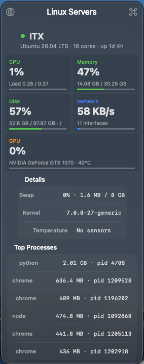

# Stats Linux Monitor

This is a fork of [exelban/stats](https://github.com/exelban/stats) focused on monitoring Linux servers from the macOS menu bar.

The original Stats app remains the foundation for local macOS monitoring, menu bar items, settings, popups, widgets, and the overall app structure. This fork replaces the original hosted remote feature with direct Linux server monitoring over authenticated HTTP endpoints, designed for servers reachable through Tailscale or another trusted private network.

## What changed in this fork

- Added a lightweight Go `server-stats-agent` for Linux hosts.
- Added authenticated Linux server endpoints: `GET /v1/health`, `GET /v1/snapshot`, and `GET /v1/stream`.
- Replaced the original remote module with a self-hosted **Linux Servers** module.
- Added one macOS menu bar item per configured Linux server.
- Added server settings for name, URL, token, enabled state, ordering, and display mode.
- Store server bearer tokens in macOS Keychain.
- Render Stats-style server popups with CPU, memory, disk, network, optional GPU/sensors, uptime, and top processes.
- Keep the existing local macOS Stats modules intact.

## Screenshots

Linux server menu bar items:


Linux server popup:



## Goals and limitations

This fork is intentionally different from upstream Stats:

- It is focused on small personal or homelab fleets, not a hosted account-based remote monitoring service.
- It expects each Linux server to run the bundled agent and be reachable directly, ideally through Tailscale.
- It does not try to be Prometheus, Grafana, or a central metrics database.
- It is not intended to preserve upstream's original hosted remote feature.
- Upstream Stats releases and Homebrew packages do not include this Linux server monitoring work.

<a href="https://github.com/exelban/stats/releases"><p align="center"></p></a>

[](https://github.com/exelban/stats/releases)
[](https://github.com/exelban/stats/releases)

macOS and Linux server monitor in your menu bar.

## Installation
This fork currently needs to be built from source with Xcode. The links below are for upstream Stats and are kept for historical context only; they do not install this fork's Linux server monitoring module.

### Manual
You can download the latest version [here](https://github.com/exelban/stats/releases/latest/download/Stats.dmg).
This will download a file called `Stats.dmg`. Open it and move the app to the application folder.

### Homebrew
To install it using Homebrew, open the Terminal app and type:
```bash
brew install stats
```

### Legacy version
Legacy version for older systems could be found [here](https://mac-stats.com/downloads).

## Requirements
Stats is supported on the released macOS version starting from macOS 12 (Monterey).

## Features
Stats Linux Monitor lets you monitor your Mac and configured Linux servers from the macOS menu bar.

Local macOS modules inherited from upstream Stats:

 - CPU utilization
 - GPU utilization
 - Memory usage
 - Disk utilization
 - Network usage
 - Battery level
 - Fan's control (not maintained)
 - Sensors information (Temperature/Voltage/Power)
 - Bluetooth devices
 - Multiple time zone clock

Linux server monitoring added by this fork:

 - Per-server menu bar status
 - CPU utilization and load
 - Memory and swap usage
 - Disk capacity and utilization
 - Network throughput
 - Uptime and kernel details
 - Top processes
 - Temperature sensors when available
 - Optional NVIDIA GPU metrics when `nvidia-smi` is available
 - Offline/error state with retry backoff

See [LINUX_SERVERS.md](./LINUX_SERVERS.md) for agent setup and server configuration.

## FAQs

### How do you change the order of the menu bar icons?
macOS decides the order of the menu bar items not `Stats` - it may change after the first reboot after installing Stats.

To change the order of any menu bar icon - macOS Mojave (version 10.14) and up.

1. Hold down ⌘ (command key).
2. Drag the icon to the desired position on the menu bar.
3. Release ⌘ (command key)

### Stats icons do not appear in the menu bar
macOS 26 introduced a new privacy control under System Settings → Menu Bar. Apps must be explicitly allowed there to display menu bar items. If Stats is running with at least one module active and one widget enabled, but none of its icons show up in the menu bar, this is almost certainly the cause. More details you can find [here](https://github.com/exelban/stats/issues/3120).

**Solution:** open **System Settings → Menu Bar** and toggle **Stats** ON.

### Desktop widgets not showing the data
Due to a problem with high data load in the system process (`chronod`) responsible for communication between the app and widgets, communication is disabled by default on the Stats side. To enable it, the `macOS widgets` option must be enabled in the Stats settings. More details you can find [here](https://github.com/exelban/stats/issues/2733).

**Solution:** open **Stats Settings** and toggle **macOS widgets** ON.

### How to reduce energy impact or CPU usage of Stats?
Stats tries to be efficient as it's possible. But reading some data periodically is not a cheap task. Each module has its own "price". So, if you want to reduce energy impact from the Stats you need to disable some Stats modules. The most inefficient modules are Sensors and Bluetooth. Disabling these modules could reduce CPU usage and power efficiency by up to 50% in some cases.

### Fan control
Fan control is in legacy mode. It does not receive any updates or fixes. It's not dropped from the app just because in the old Macs it works pretty acceptable. I'm open to accepting fixed or improvements (via PR) for this feature in case someone would like to help with that. But have no option and time to provide support for this feature.

### Sensors show incorrect CPU/GPU core count
CPU/GPU sensors are simply thermal zones (sensors) on the CPU/GPU. They have no relation to the number of cores or specific cores.
For example, a CPU is typically divided into two clusters: efficiency and performance. Each cluster contains multiple temperature sensors, and Stats simply displays these sensors. However, "CPU Efficient Core 1" does not represent the temperature of a single efficient core—it only indicates one of the temperature sensors within the efficiency core cluster.
Additionally, with each new SoC, Apple changes the sensor keys. As a result, it takes time to determine which SMC values correspond to the appropriate sensors. If anyone knows how to accurately match the sensors for Apple Silicon, please contact me.

### App crash – what to do?
First, ensure that you are using the latest version of Stats. There is a high chance that a fix preventing the crash has already been released. If you are already running the latest version, check the open issues. Only if none of the existing issues address your problem should you open a new issue.

### Why my issue was closed without any response?
Most probably because it's a duplicated issue and there is an answer to the question, report, or proposition. Please use a search by closed issues to get an answer.
So, if your issue was closed without any response, most probably it already has a response.

### External API
Stats uses some external APIs, such as:

- https://api.mac-stats.com – For update checks and retrieving the public IP address
- https://api.github.com – Fallback for update checks

Both of these APIs are used to check for updates. Additionally, an external request is required to obtain the public IP address. I do not want to use any third-party providers for retrieving the public IP address, so I use my own server for this purpose.

If you have concerns about these requests, you have a few options:

- propose a PR that allows these features to work without an external server
- block both of these servers using any network filtering app (if you're reading this, you're likely using something like Little Snitch, so you can easily do this). In this case do not expect to receive any updates or see your public IP in the network module.

### How to contribute to the project?
If you want to develop a new feature or you've found something that doesn't work, the first step is to open an issue so the feature or problem can be discussed. Pull requests should only be opened for existing issues and after discussion; otherwise, they may be closed automatically. There are a few cases where this can be skipped: for language changes, and for contributors who have already made significant contributions and whose implementations align well with the project.

## Supported languages
- English
- Polski
- Українська
- Русский
- 中文 (简体) (thanks to [chenguokai](https://github.com/chenguokai), [Tai-Zhou](https://github.com/Tai-Zhou), and [Jerry](https://github.com/Jerry23011))
- Türkçe (thanks to [yusufozgul](https://github.com/yusufozgul) and [setanarut](https://github.com/setanarut))
- 한국어 (thanks to [escapeanaemia](https://github.com/escapeanaemia) and [iamhslee](https://github.com/iamhslee))
- German (thanks to [natterstefan](https://github.com/natterstefan) and [aneitel](https://github.com/aneitel))
- 中文 (繁體) (thanks to [iamch15542](https://github.com/iamch15542) and [jrthsr700tmax](https://github.com/jrthsr700tmax))
- Spanish (thanks to [jcconca](https://github.com/jcconca))
- Vietnamese (thanks to [HXD.VN](https://github.com/xuandung38))
- French (thanks to [RomainLt](https://github.com/RomainLt))
- Italian (thanks to [gmcinalli](https://github.com/gmcinalli))
- Portuguese (Brazil) (thanks to [marcelochaves95](https://github.com/marcelochaves95) and [pedroserigatto](https://github.com/pedroserigatto))
- Norwegian Bokmål (thanks to [rubjo](https://github.com/rubjo))
- 日本語 (thanks to [treastrain](https://github.com/treastrain))
- Portuguese (Portugal) (thanks to [AdamModus](https://github.com/AdamModus))
- Czech (thanks to [mpl75](https://github.com/mpl75))
- Magyar (thanks to [moriczr](https://github.com/moriczr))
- Bulgarian (thanks to [zbrox](https://github.com/zbrox))
- Romanian (thanks to [razluta](https://github.com/razluta))
- Dutch (thanks to [ngohungphuc](https://github.com/ngohungphuc))
- Hrvatski (thanks to [milotype](https://github.com/milotype))
- Danish (thanks to [casperes1996](https://github.com/casperes1996) and [aleksanderbl29](https://github.com/aleksanderbl29))
- Catalan (thanks to [davidalonso](https://github.com/davidalonso))
- Indonesian (thanks to [yooody](https://github.com/yooody))
- Hebrew (thanks to [BadSugar](https://github.com/BadSugar))
- Slovenian (thanks to [zigapovhe](https://github.com/zigapovhe))
- Greek (thanks to [sudoxcess](https://github.com/sudoxcess) and [vaionicle](https://github.com/vaionicle))
- Persian (thanks to [ShawnAlisson](https://github.com/ShawnAlisson))
- Slovenský (thanks to [martinbernat](https://github.com/martinbernat))
- Thai (thanks to [apiphoomchu](https://github.com/apiphoomchu))
- Estonian (thanks to [postylem](https://github.com/postylem))
- Hindi (thanks to [patiljignesh](https://github.com/patiljignesh))
- Finnish (thanks to [eightscrow](https://github.com/eightscrow))

You can help by adding a new language or improving the existing translation.

## License
[MIT License](https://github.com/exelban/stats/blob/master/LICENSE)
